# Phase 1 — Identity Design

> **Cashville Financial Group IAM Implementation**  
> Designing the foundational identity, privileged-access, emergency-access, and delegated-administration model for a fictional financial services organization using Microsoft Entra ID.

---

## 📌 Executive Summary

Phase 1 establishes the identity security foundation for **Cashville Financial Group (CFG)**.

The objective was not simply to create users and assign administrative roles. The environment was designed around core Identity & Access Management principles including **identity separation, least privilege, administrative scoping, reduction of standing privilege, emergency access, validation, and privilege cleanup**.

The resulting design uses Microsoft Entra ID, Microsoft Entra administrative roles, Administrative Units, Privileged Identity Management (PIM), and Microsoft Graph to establish a controlled privileged-access model.

### Phase 1 Outcomes

- Separated standard workforce and privileged administrative identities.
- Established dedicated emergency-access identities.
- Created a delegated administrative boundary for New York identities.
- Scoped User Administrator privileges to that administrative boundary.
- Implemented PIM-eligible administrative access.
- Reduced unnecessary standing privileged access.
- Established authentication and sign-in baselines for emergency access.
- Investigated a failed PIM configuration using audit evidence and Microsoft Graph.
- Used temporary privileged access during remediation.
- Removed temporary administrative privilege after remediation.
- Revoked Microsoft Graph PIM write capability after troubleshooting.

---

## 🏗️ Identity Architecture

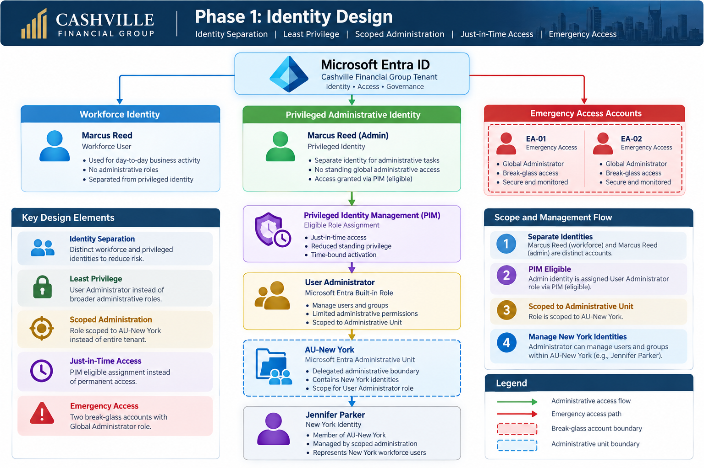

The Phase 1 architecture separates three distinct identity use cases:

1. **Workforce Identity** — used for normal day-to-day business activity.
2. **Privileged Administrative Identity** — used separately for elevated IAM responsibilities.
3. **Emergency-Access Identities** — reserved for critical administrative recovery scenarios.

The privileged administrative path is further restricted through **PIM eligibility, role selection, and Administrative Unit scoping**.

The resulting security model can be summarized as:

**Identity → Privilege → Scope → Eligibility → Validation**

---

## 🏦 Business Scenario

Cashville Financial Group requires a Microsoft Entra identity model capable of supporting normal workforce operations while reducing the security risks associated with privileged administration.

The initial identity design needed to address several IAM concerns:

- Administrators should not perform privileged tasks from their everyday workforce identities.
- Administrative permissions should not be broader than required.
- Regional identity administration should be delegated without automatically granting tenant-wide authority.
- Standing privileged access should be reduced where possible.
- Emergency administrative access should remain available for critical recovery scenarios.
- Privileged-access changes should be validated and documented.
- Temporary troubleshooting privilege should be removed when no longer required.

These requirements became the foundation for the Phase 1 implementation.

---

## 🔐 Security Design Principles

| Principle | Phase 1 Implementation |
|---|---|
| **Identity Separation** | Separate workforce and privileged identities for Marcus Reed |
| **Least Privilege** | User Administrator used instead of unnecessarily broader administrative authority |
| **Administrative Scoping** | User Administrator privileges constrained to AU-New York |
| **Reduced Standing Privilege** | Administrative access configured as PIM eligible |
| **Emergency Access** | Dedicated emergency-access identities assigned Global Administrator |
| **Validation** | Authentication, sign-in, role, scope, and privileged-access states reviewed |
| **Privilege Cleanup** | Temporary troubleshooting privilege and Graph PIM write capability removed after remediation |

---

# 1. Workforce & Privileged Identity Separation

One of the first design decisions was separating normal workforce activity from privileged administrative activity.

Marcus Reed therefore has two distinct identities within the CFG environment.

## Workforce Identity

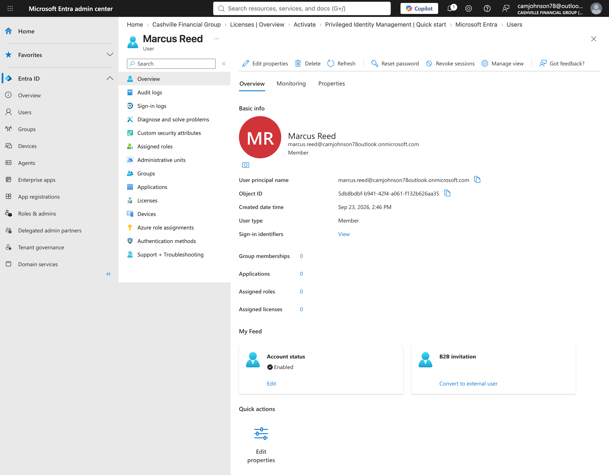

Marcus Reed's workforce identity represents his normal employee account.

This identity is intended for routine business activity rather than privileged IAM administration.

## Privileged Administrative Identity

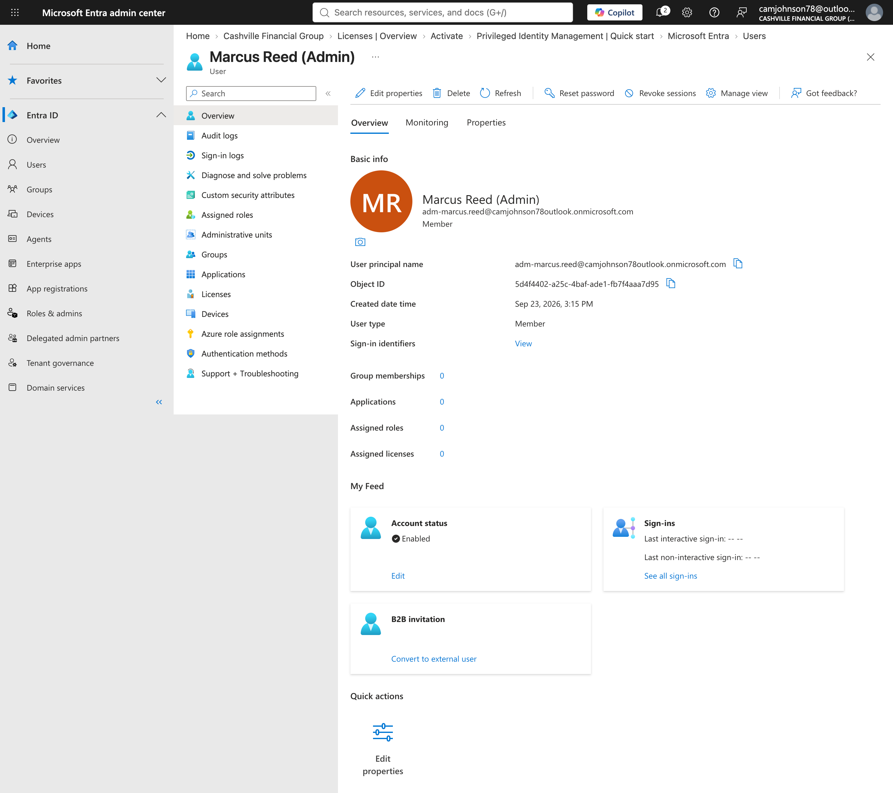

A separate administrative identity was created for Marcus's privileged responsibilities.

### Security Rationale

Separating workforce and privileged identities reduces the amount of routine activity performed using privileged credentials.

The resulting model is:

```text
Marcus Reed
│
├── Workforce Identity
│   └── Normal business activity
│
└── Privileged Identity
    └── IAM administrative activity
```

This establishes a stronger foundation for applying least privilege and privileged-access controls later in the design.

---

# 2. Emergency Access Design

CFG also requires a recovery mechanism for scenarios in which normal administrative access is unavailable.

Dedicated emergency-access identities were therefore established.

## Emergency Access Baseline

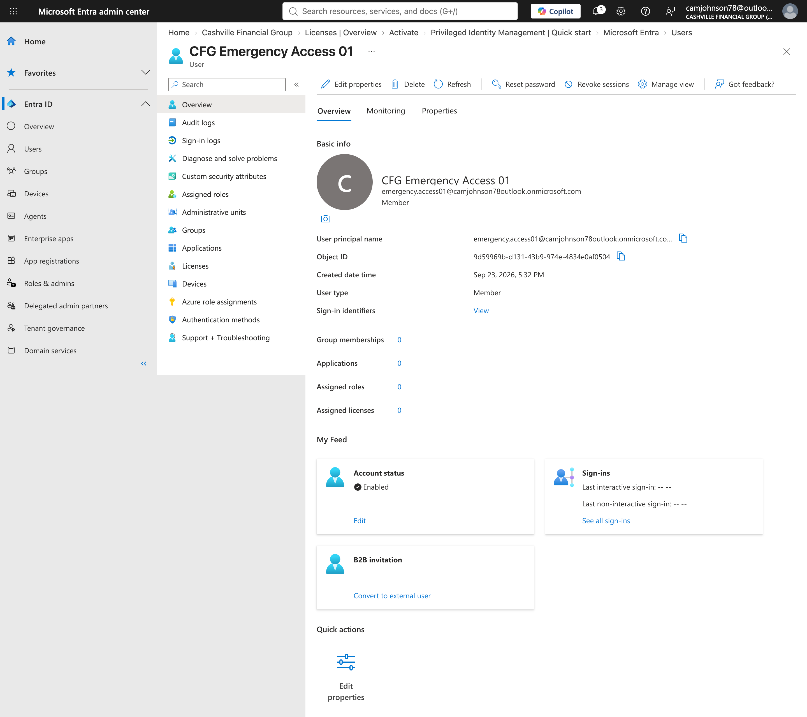

The emergency-access identity is maintained separately from normal workforce and privileged administrative identities.

## Emergency Access 01 — Global Administrator


## Emergency Access 02 — Global Administrator

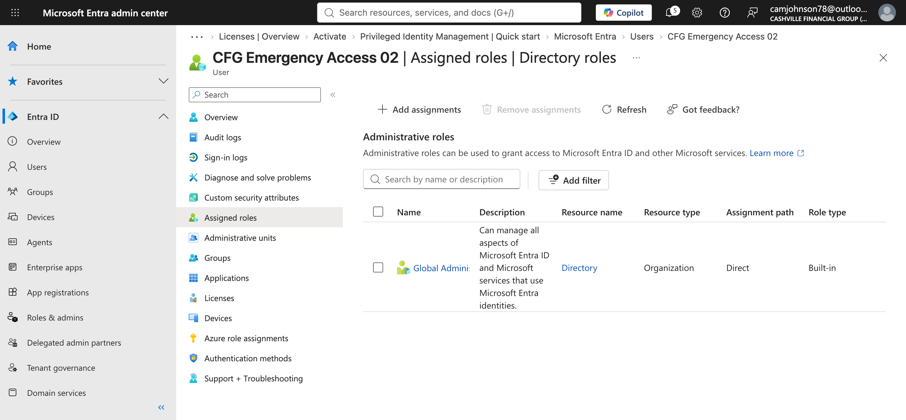

Two emergency-access identities provide redundancy for critical administrative recovery scenarios.

These accounts are intended for emergency recovery rather than routine administrative activity.

### Emergency Access Design

```text
Emergency Access
│
├── Emergency Access 01
│   └── Global Administrator
│
└── Emergency Access 02
    └── Global Administrator
```

This design separates emergency recovery capability from CFG's normal privileged-administration workflow.

---

# 3. Delegated Administration with Administrative Units

The next requirement involved limiting administrative scope.

Marcus needed the ability to perform identity administration for New York identities without requiring equivalent authority across the entire CFG tenant.

Microsoft Entra **Administrative Units** were used to establish that boundary.

## AU-New York

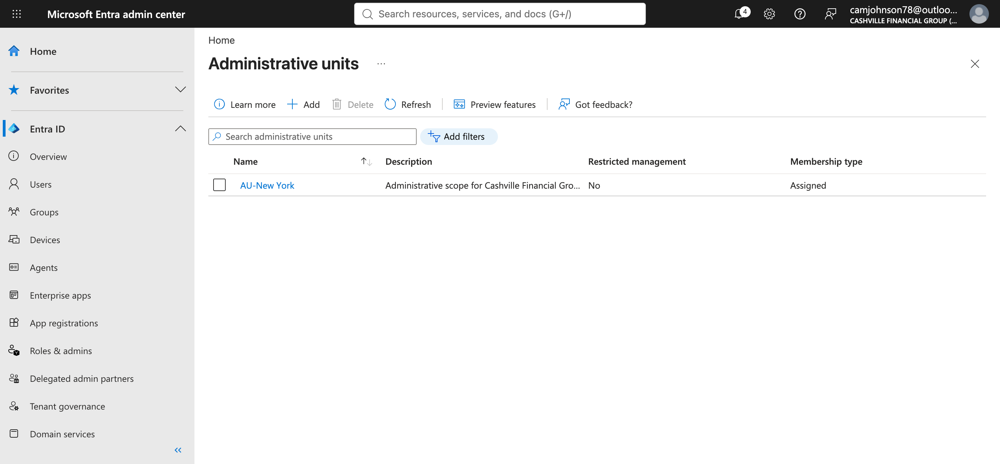

`AU-New York` represents the administrative boundary for identities that fall within the New York scope.

## Representative New York Identity

Jennifer Parker was used as a representative New York workforce identity.

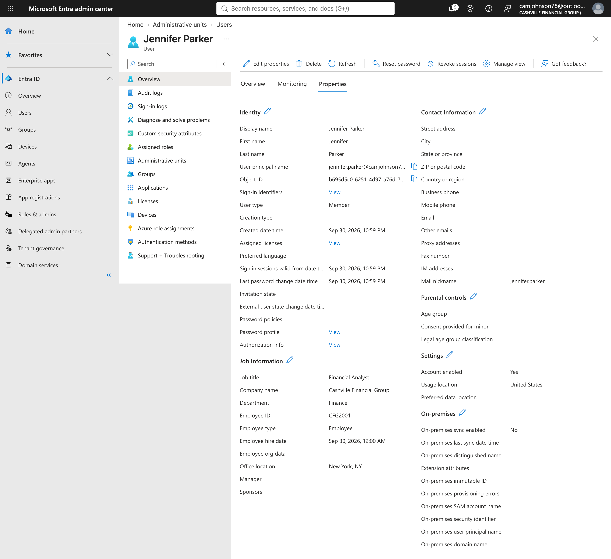

## Administrative Unit Membership

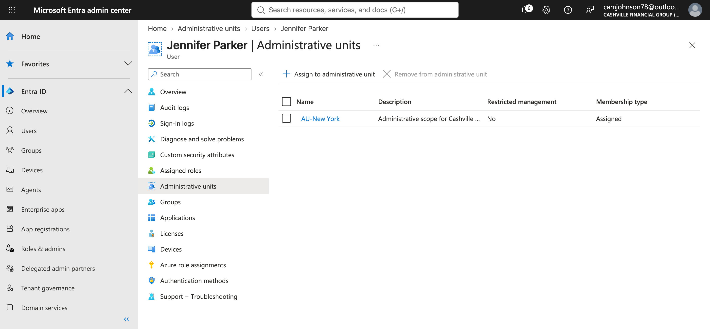

Jennifer's membership places her user object within the administrative scope represented by `AU-New York`.

### Important IAM Distinction

An Administrative Unit does **not** determine what applications Jennifer can access.

Instead, it establishes an **administrative scope**.

The Microsoft Entra role determines:

> **What can the administrator do?**

The Administrative Unit determines:

> **Where can the administrator do it?**

This distinction became important when designing Marcus's least-privilege administrative access.

---

# 4. Least-Privilege Administrative Scope

With the Administrative Unit established, the next objective was reducing Marcus's administrative authority to the required scope.

## Administrative Scope Transition

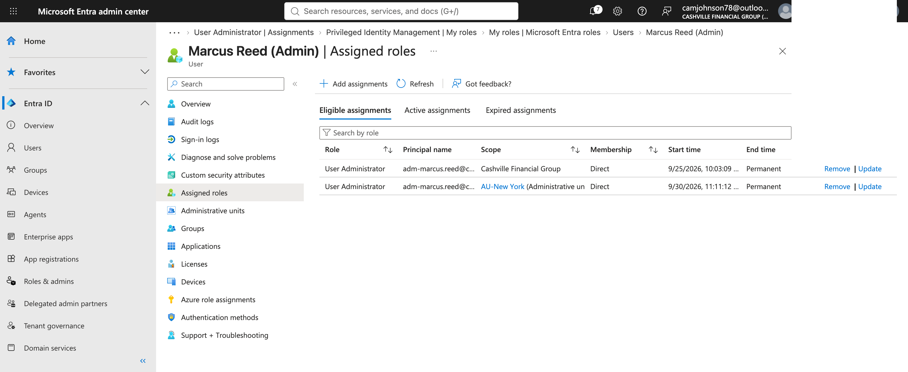

The implementation transitioned away from broader administrative authority toward a scoped administrative model.

## Final Least-Privilege State

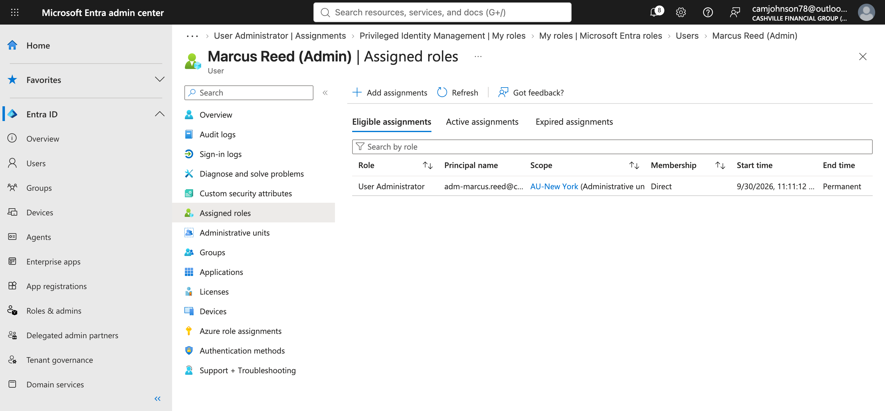

Marcus's privileged identity receives the **User Administrator** role scoped specifically to **AU-New York**.

The resulting authorization model is:

```text
Marcus Reed (Admin)
        │
        ▼
User Administrator
        │
        ▼
   AU-New York
        │
        ▼
New York Identities
        │
        ▼
Jennifer Parker
```

This limits both the **level of privilege** and the **scope of privilege**.

Rather than treating least privilege as simply choosing a less-powerful role, the design considers both:

- **Role** — what administrative actions Marcus can perform.
- **Scope** — where Marcus can perform those actions.

---

# 5. Privileged Identity Management (PIM)

Administrative scope alone does not address how privileged access is provided.

Microsoft Entra **Privileged Identity Management (PIM)** was therefore incorporated into the design.

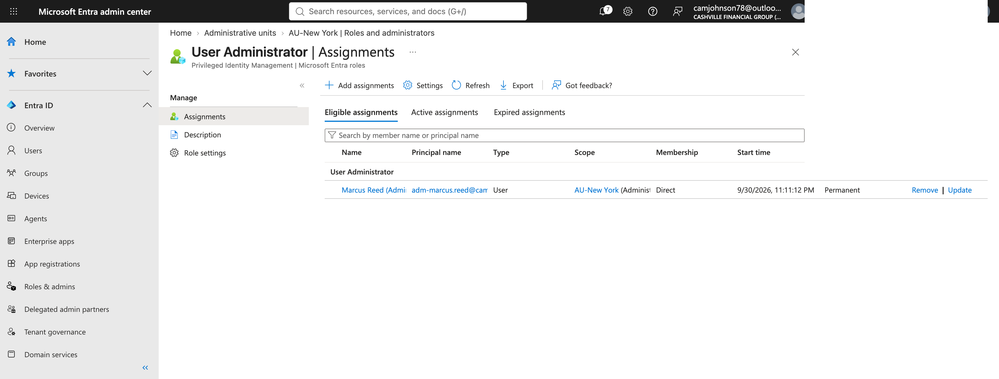

Marcus's privileged identity is configured with an eligible User Administrator assignment associated with the New York administrative scope.

This adds another control to the privileged-access model:

```text
WHO?
Marcus Reed's privileged identity

        ↓

WHAT ROLE?
User Administrator

        ↓

HOW IS PRIVILEGE PROVIDED?
PIM eligible assignment

        ↓

WHERE?
AU-New York
```

Rather than relying only on a permanently active administrative assignment, the design incorporates PIM eligibility as part of reducing standing privilege.

### Combined Privileged-Access Model

At this point, the Phase 1 administrative model includes multiple security controls working together:

```text
Separate Privileged Identity
            │
            ▼
     User Administrator
            │
            ▼
       PIM Eligible
            │
            ▼
       AU-New York
            │
            ▼
    New York Identities
```

Each layer answers a different IAM question:

| Question | Control |
|---|---|
| **Who receives privilege?** | Marcus Reed's separate privileged identity |
| **What can he do?** | User Administrator |
| **Where can he do it?** | AU-New York |
| **How is privilege provided?** | PIM eligibility |

---

# 6. Validation

Configuration alone does not demonstrate that an IAM control reached its intended state.

Phase 1 therefore included validation of key identity and access configurations.

## Emergency Access Authentication Baseline

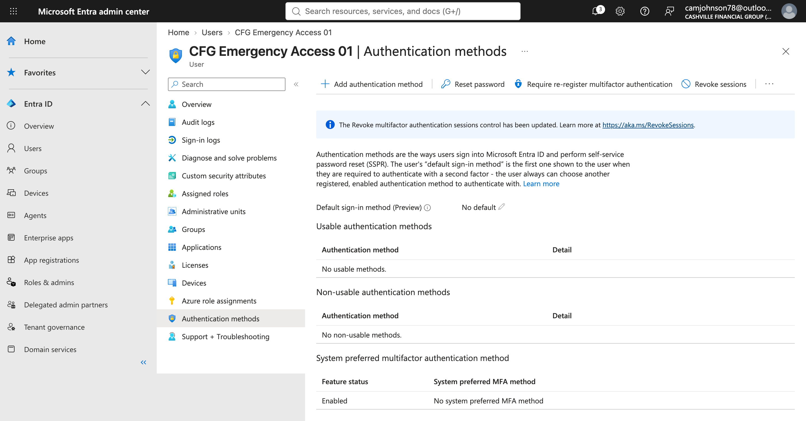

The authentication state of the emergency-access identity was reviewed and documented as part of the baseline.

## Emergency Access Sign-In Baseline

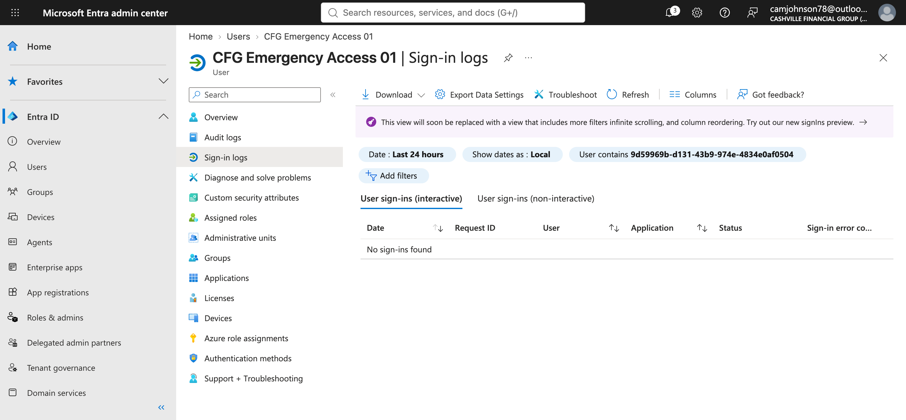

Sign-in information was also reviewed to establish baseline evidence associated with the emergency-access identity.

These records provide a documented starting point for future monitoring and governance activities.

---

# 7. Troubleshooting Case Study — PIM Assignment Failure

One of the most valuable parts of Phase 1 occurred when the intended PIM configuration did not initially succeed.

Rather than treating the failed attempt as disposable lab activity, the investigation was documented as part of the implementation.

The troubleshooting workflow followed:

```text
PIM Configuration Attempt
          │
          ▼
   Assignment Failure
          │
          ▼
     Audit Evidence
          │
          ▼
Microsoft Graph Investigation
          │
          ▼
Privileged-Access Investigation
          │
          ▼
Temporary Troubleshooting Privilege
          │
          ▼
      Remediation
          │
          ▼
Successful Final Configuration
          │
          ▼
   Privilege Cleanup
          │
          ▼
 Return to Least Privilege
```

---

## 7.1 Initial Assignment Failure

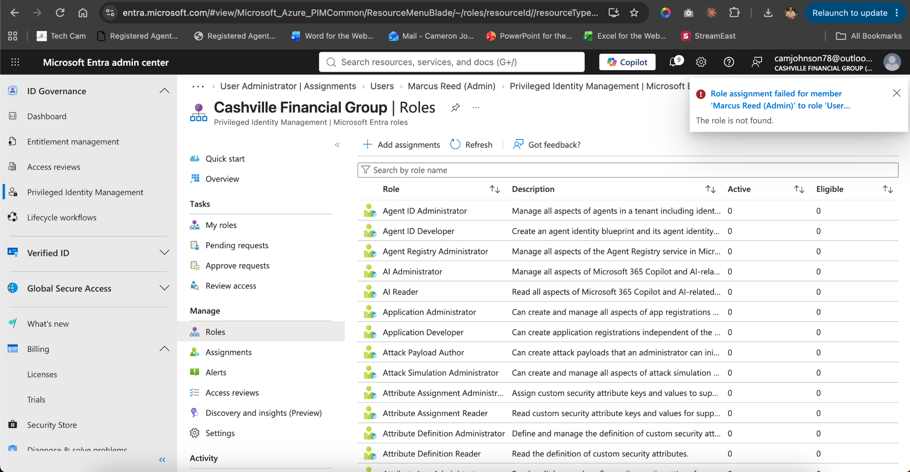

The attempt to configure the intended User Administrator assignment through PIM encountered a failure.

Rather than repeatedly attempting the same configuration, the failure became the starting point for a structured investigation.

---

## 7.2 Audit Evidence

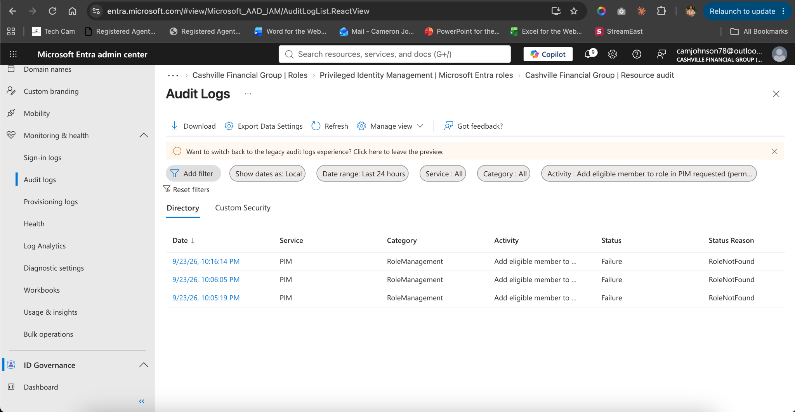

Audit evidence exposed a `RoleNotFound` condition associated with the failed operation.

This provided a more useful troubleshooting direction than relying only on the portal error.

The next step was to inspect the underlying role and privileged-access state.

---

## 7.3 Microsoft Graph Role Investigation

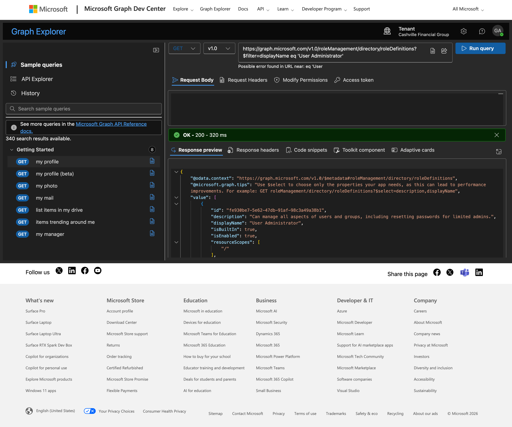

Microsoft Graph was used during troubleshooting to inspect the relevant role definition and investigate the User Administrator role being referenced.

The investigation then extended to the existing PIM eligibility state.

---

## 7.4 PIM Eligibility Investigation

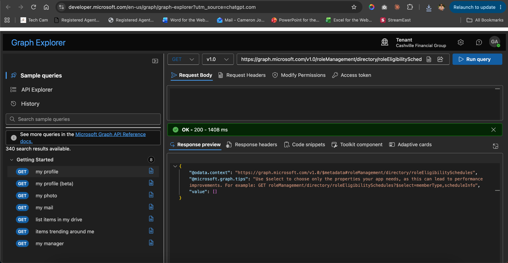

The eligibility schedule investigation provided additional evidence about the existing privileged-access state.

Using Microsoft Graph allowed the troubleshooting process to extend beyond the information exposed through the administrative portal.

---

## 7.5 Temporary Troubleshooting Privilege

Resolving the configuration required temporary privileged capability during the investigation.

This access was treated as temporary rather than becoming part of Marcus's permanent administrative model.

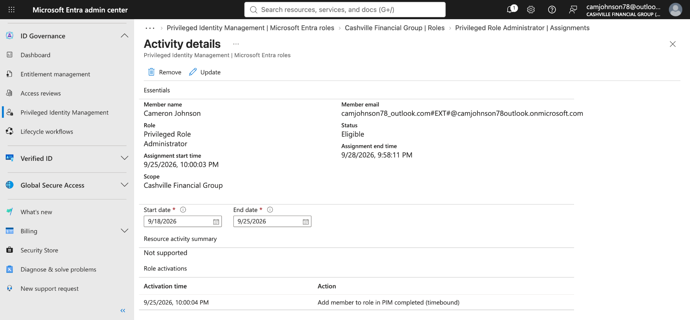

The security objective was not merely obtaining enough privilege to troubleshoot the problem.

It was also ensuring that temporary elevation did not silently become permanent standing access.

---

## 7.6 Privilege Cleanup

After the required configuration work was completed, the temporary privileged role was removed.

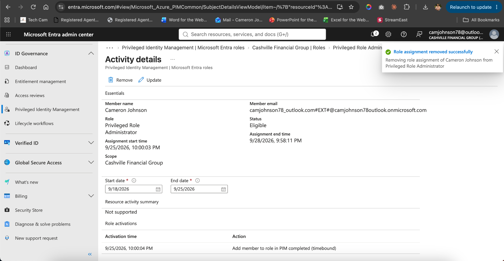

Microsoft Graph PIM write capability used during troubleshooting was also revoked.

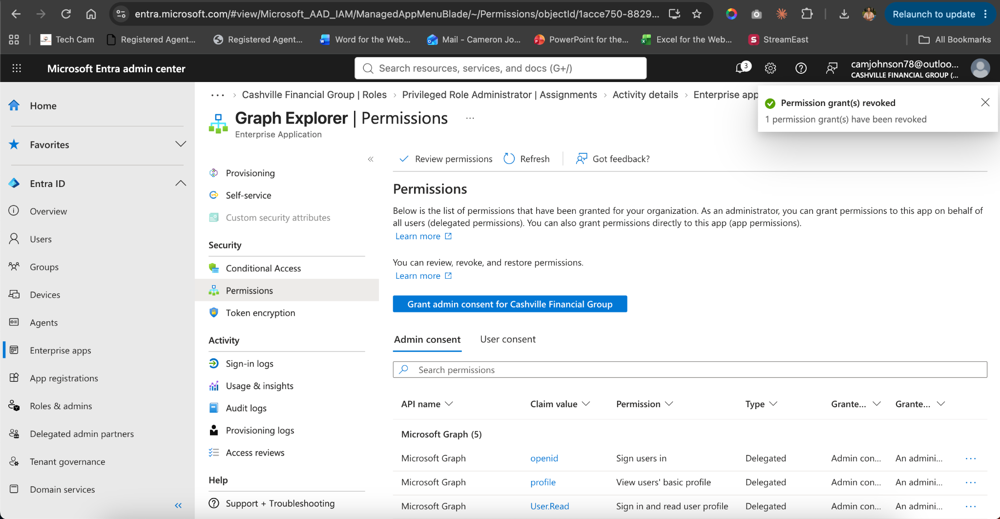

### Troubleshooting Outcome

The troubleshooting process reinforced an important IAM operational principle:

> **Temporary privilege used for administration or troubleshooting should not silently become permanent privilege.**

The environment was returned to the intended least-privilege configuration after remediation.

The troubleshooting process demonstrated a complete operational cycle:

**Failure → Evidence → Investigation → Remediation → Validation → Cleanup**

---

# 8. Final Phase 1 Security State

At the completion of Phase 1, Cashville Financial Group has established the following identity-security foundation:

| Control | Final State |
|---|---|
| **Workforce Identity** | Separated from privileged administration |
| **Privileged Identity** | Dedicated administrative identity |
| **Emergency Access** | Two dedicated emergency-access identities |
| **Emergency Privilege** | Global Administrator for recovery use |
| **Delegated Boundary** | AU-New York |
| **Representative Scoped User** | Jennifer Parker |
| **Administrative Role** | User Administrator |
| **Administrative Scope** | AU-New York |
| **Privileged-Access Model** | PIM eligible |
| **Troubleshooting Privilege** | Removed after use |
| **Graph PIM Write Capability** | Revoked after troubleshooting |

---

# 9. Skills Demonstrated

Phase 1 provided hands-on implementation and troubleshooting experience with:

### Identity Administration

- Microsoft Entra ID
- Workforce identity design
- Privileged identity separation
- User administration
- Administrative role assignments

### Privileged Access

- Microsoft Entra Privileged Identity Management
- Eligible administrative assignments
- Standing-privilege reduction
- Emergency-access design
- Temporary privilege management
- Post-remediation privilege cleanup

### Delegated Administration

- Microsoft Entra Administrative Units
- Scoped administration
- User Administrator
- Role and scope separation
- Least-privilege design

### Troubleshooting & Validation

- Microsoft Entra audit evidence
- Microsoft Graph investigation
- PIM troubleshooting
- Role-definition investigation
- Eligibility-state investigation
- Authentication baseline review
- Sign-in baseline review
- Final-state validation

### Documentation

- Technical evidence collection
- Architecture documentation
- Security rationale
- Troubleshooting documentation
- Implementation case-study development

---

# 10. Lessons Learned

Phase 1 reinforced several IAM concepts that became clearer through hands-on implementation.

## Role and Scope Solve Different Problems

The **User Administrator** role determines what administrative actions Marcus can perform.

**AU-New York** determines where those permissions apply.

```text
ROLE  = What can Marcus do?

SCOPE = Where can Marcus do it?
```

Both must be considered when designing least-privilege administration.

---

## Administrative Units Are Not Access Groups

Placing an identity within an Administrative Unit establishes administrative scope.

It does not automatically grant that identity access to applications or resources.

Administrative Units are therefore part of **delegated administration**, not a replacement for application authorization or group-based access.

---

## Least Privilege Has Multiple Dimensions

Least privilege is not simply selecting a smaller administrative role.

The design must consider:

1. **Which identity receives the privilege?**
2. **Which role does that identity require?**
3. **What scope should the role apply to?**
4. **Does the privilege need to remain permanently active?**
5. **Was temporary privilege removed after use?**

Phase 1 applied each of these questions to Marcus's administrative model.

---

## Privileged Identity Separation Reduces Exposure

Using a separate privileged identity limits the amount of routine activity performed from an administrative account.

This creates a clearer boundary between:

**normal workforce activity**

and

**privileged administrative activity.**

---

## Troubleshooting Is Part of IAM Engineering

The PIM issue demonstrated that implementation does not always follow the expected path.

Reaching the intended final state required:

- Reviewing the initial failure
- Examining audit evidence
- Investigating role information
- Using Microsoft Graph
- Inspecting PIM eligibility state
- Managing temporary privilege
- Validating the final configuration
- Removing unnecessary privilege afterward

The troubleshooting process became part of the implementation rather than something hidden from the final documentation.

---

## Privilege Cleanup Matters

Obtaining elevated privilege may sometimes be necessary for administrative or troubleshooting activity.

The security responsibility does not end when the technical problem is solved.

Temporary access must also be removed.

Phase 1 therefore documented both:

```text
Privilege Elevation
        ↓
Required Administrative Work
        ↓
Successful Remediation
        ↓
Privilege Removal
        ↓
Return to Least Privilege
```

---

# 11. Phase 1 Complete

Phase 1 established the foundational identity and privileged-access architecture for Cashville Financial Group.

The environment now has a defined model for:

```text
IDENTITY
   ↓
PRIVILEGE
   ↓
SCOPE
   ↓
ELIGIBILITY
   ↓
VALIDATION
   ↓
CLEANUP
```

Rather than beginning later IAM processes with an undefined administrative model, future phases can build on an established identity-security foundation.

Phase 1 demonstrates that privileged access is not simply a matter of assigning an administrative role.

A complete IAM design must consider:

> **Who receives access, what they can do, where they can do it, how that privilege is provided, how the configuration is validated, and how unnecessary privilege is removed.**

---

## 📂 Evidence Repository

Supporting implementation evidence is organized by control area:

- [`01-identity-separation`](./evidence/01-identity-separation/)
- [`02-emergency-access`](./evidence/02-emergency-access/)
- [`03-administrative-units`](./evidence/03-administrative-units/)
- [`04-least-privilege`](./evidence/04-least-privilege/)
- [`05-pim`](./evidence/05-pim/)
- [`06-validation`](./evidence/06-validation/)

Additional investigation evidence is available in:

- [`troubleshooting`](./troubleshooting/)

Architecture documentation is available in:

- [`architecture`](./architecture/)

---

## 🧭 Repository Navigation

⬅️ **[Return to Cashville Financial Group IAM Program Overview](../README.md)**

🗺️ **[View Phase 1 Architecture](./architecture/)**

📸 **[View Phase 1 Evidence](./evidence/)**

🔧 **[View Phase 1 Troubleshooting Evidence](./troubleshooting/)**

---

> **Lab Environment Disclaimer:** Cashville Financial Group is a fictional organization created solely for this hands-on IAM portfolio project. The identities, organizational structure, and administrative scenarios documented here are part of a controlled Microsoft Entra lab environment and do not represent a production financial institution.
